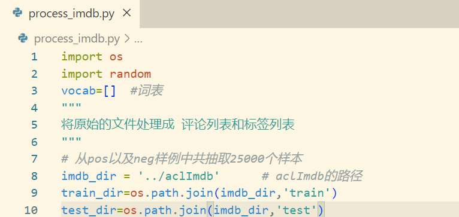
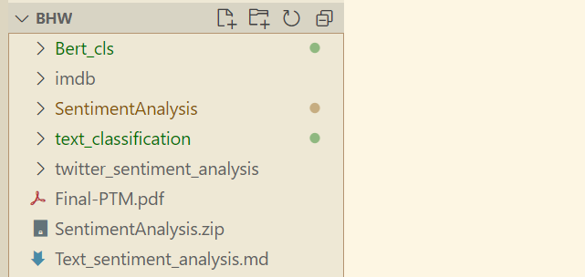
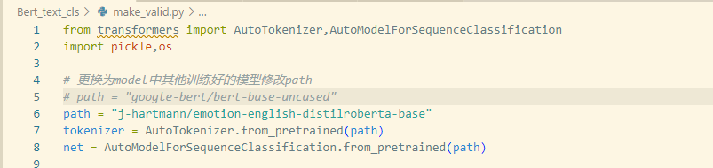
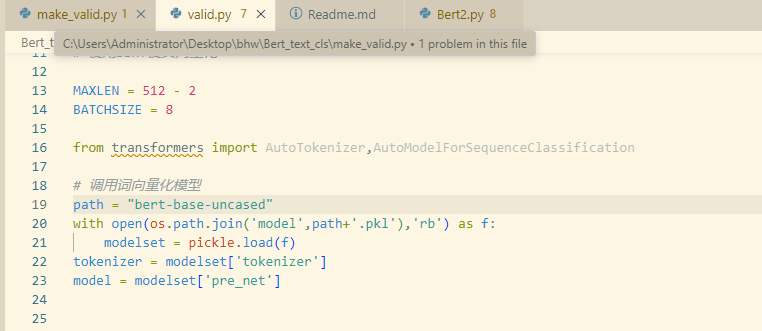

# 说明：
* 之前忘记添加aclImdb数据集的处理文件——process_imdb.py，

  其中imdb_dir为IMDB数据集的路径



数据集我是这样放的(和Bert_cls并列)：




* make_pretrain,bert_train,bert_test是用于基于bert-base-uncased预训练的
* 测试模型只要两步：

1. make_valid中修改path的值并执行```python make_valid.py```



* 会在当前model目录下生成一个模型（要用代理，所以在本地进行)

2. valid.py中修改path的名字为前面模型"/"后的模型名，并运行(本地，没N卡的话，要把本地模型上传到云GPU的model目录下)



